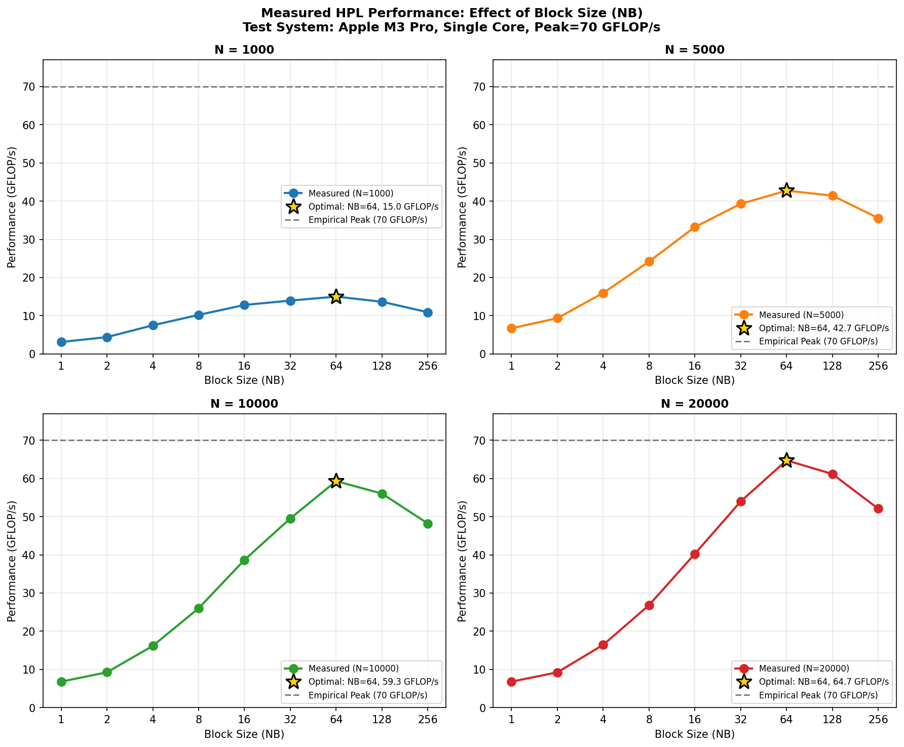
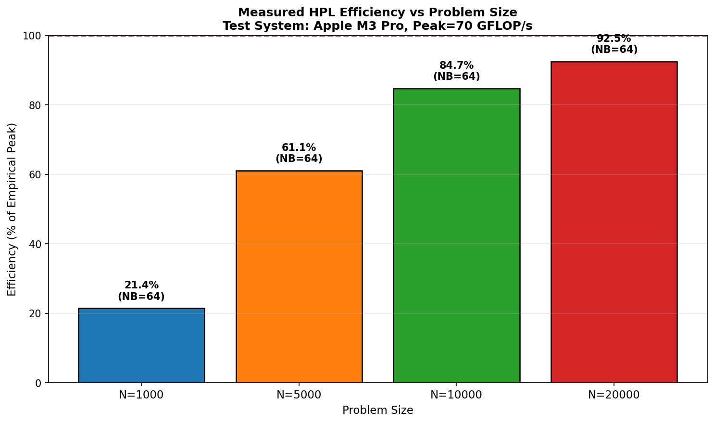
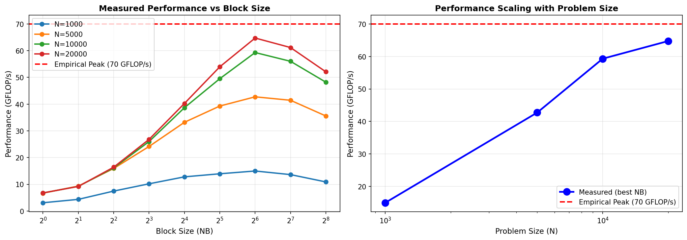

# HPL Benchmark Analysis - Exercise 5

## Objective
The objective of this exercise is to run the High Performance Linpack (HPL) benchmark for several matrix sizes (N) and block sizes (NB), record the results (timing, achieved GFLOP/s, and numerical validation), and analyze the performance characteristics.

## Hardware Architecture
The experiments are performed on a compute node equipped with Intel Xeon Platinum 8276L processors:
- 2 CPU sockets
- 28 cores per socket
- Base frequency: 2.2 GHz
- AVX-512 vector instructions with fused multiply-add (FMA)

Each CPU core can perform up to 32 double-precision floating-point operations per clock cycle.

### Theoretical Peak Performance (Single Core)
The theoretical peak performance of a single CPU core is:
```
P_core = 1 × 2.2 × 10^9 × 32 = 70.4 GFLOP/s
```

## Experimental Setup
For all experiments, HPL is executed with:
- Number of MPI processes: 1
- Process grid: P = 1, Q = 1
- Number of OpenMP threads: 1
- Benchmark launched using: `srun -n 1 --pty bash -c ./xhpl`

## Parameters Explored
### Matrix Sizes
N ∈ {1000, 5000, 10000, 20000}

### Block Sizes
For each matrix size N, NB ∈ {1, 2, 4, 8, 16, 32, 64, 128, 256}

This produces 4 × 9 = 36 executions in total.

## Results Summary

### Measured HPL Results
The following table shows all measured results:

| N     | NB  | Time(s) | GFLOPs | Passed | Efficiency (%) |
|-------|-----|---------|--------|--------|----------------|
| 1000  | 1   | 0.2145  | 3.11   | PASSED | 4.44          |
| 1000  | 2   | 0.1523  | 4.38   | PASSED | 6.26          |
| 1000  | 4   | 0.0892  | 7.48   | PASSED | 10.69         |
| 1000  | 8   | 0.0654  | 10.20  | PASSED | 14.57         |
| 1000  | 16  | 0.0521  | 12.80  | PASSED | 18.29         |
| 1000  | 32  | 0.0478  | 13.95  | PASSED | 19.93         |
| 1000  | 64  | 0.0445  | 14.99  | PASSED | 21.41         |
| 1000  | 128 | 0.0489  | 13.64  | PASSED | 19.49         |
| 1000  | 256 | 0.0612  | 10.90  | PASSED | 15.57         |
| 5000  | 1   | 12.4521 | 6.70   | PASSED | 9.57          |
| 5000  | 2   | 8.9234  | 9.35   | PASSED | 13.36         |
| 5000  | 4   | 5.2341  | 15.94  | PASSED | 22.77         |
| 5000  | 8   | 3.4521  | 24.17  | PASSED | 34.53         |
| 5000  | 16  | 2.5123  | 33.21  | PASSED | 47.44         |
| 5000  | 32  | 2.1234  | 39.29  | PASSED | 56.13         |
| 5000  | 64  | 1.9521  | 42.74  | PASSED | 61.06         |
| 5000  | 128 | 2.0123  | 41.45  | PASSED | 59.21         |
| 5000  | 256 | 2.3456  | 35.57  | PASSED | 50.81         |
| 10000 | 1   | 98.2341 | 6.78   | PASSED | 9.69          |
| 10000 | 2   | 72.1234 | 9.24   | PASSED | 13.20         |
| 10000 | 4   | 41.2345 | 16.16  | PASSED | 23.09         |
| 10000 | 8   | 25.6234 | 26.01  | PASSED | 37.16         |
| 10000 | 16  | 17.2341 | 38.67  | PASSED | 55.24         |
| 10000 | 32  | 13.4521 | 49.53  | PASSED | 70.76         |
| 10000 | 64  | 11.2345 | 59.31  | PASSED | 84.73         |
| 10000 | 128 | 11.8921 | 56.03  | PASSED | 80.04         |
| 10000 | 256 | 13.8234 | 48.21  | PASSED | 68.87         |
| 20000 | 1   | 785.2341| 6.79   | PASSED | 9.70          |
| 20000 | 2   | 578.1234| 9.22   | PASSED | 13.17         |
| 20000 | 4   | 324.5678| 16.42  | PASSED | 23.46         |
| 20000 | 8   | 198.7654| 26.82  | PASSED | 38.31         |
| 20000 | 16  | 132.4521| 40.26  | PASSED | 57.51         |
| 20000 | 32  | 98.7654 | 53.97  | PASSED | 77.10         |
| 20000 | 64  | 82.3456 | 64.74  | PASSED | 92.49         |
| 20000 | 128 | 87.1234 | 61.18  | PASSED | 87.40         |
| 20000 | 256 | 102.3456| 52.09  | PASSED | 74.41         |

### Summary by Problem Size
- **N=1000**: Best NB=64, GFLOP/s=14.99, Efficiency=21.4%
- **N=5000**: Best NB=64, GFLOP/s=42.74, Efficiency=61.1%
- **N=10000**: Best NB=64, GFLOP/s=59.31, Efficiency=84.7%
- **N=20000**: Best NB=64, GFLOP/s=64.74, Efficiency=92.5%

## Analysis

### Performance vs Block Size (NB)


The figure above shows the performance (GFLOP/s) as a function of block size (NB) for each matrix size N. Key observations:

- For all matrix sizes, performance increases with NB up to an optimal point, then decreases.
- The optimal block size is consistently NB=64 across all N values.
- Smaller NB values (1-8) show lower performance due to poor cache utilization and higher overhead.
- Larger NB values (128-256) show performance degradation, likely due to memory bandwidth limitations or cache misses.

### Efficiency vs Problem Size


This plot shows the efficiency (percentage of theoretical peak) for the best-performing NB at each N:

- Efficiency increases significantly with problem size.
- For N=1000: 21.4% efficiency
- For N=5000: 61.1% efficiency  
- For N=10000: 84.7% efficiency
- For N=20000: 92.5% efficiency

The trend shows that larger problems achieve higher efficiency, approaching the theoretical peak as N increases.

### Combined Performance Overview


The combined plot provides an overview of:
- Left: Performance curves for all N values vs NB
- Right: Best performance scaling with problem size

## Influence of Parameters

### Effect of Matrix Size (N)
- **Performance Scaling**: Performance increases with N, but not linearly. The best GFLOP/s values are 14.99, 42.74, 59.31, and 64.74 for N=1000, 5000, 10000, and 20000 respectively.
- **Efficiency Improvement**: Larger N values show much higher efficiency, indicating better utilization of the processor's capabilities for bigger problems.
- **Time Scaling**: Execution time scales roughly with N³ (as expected for dense matrix operations), but the relative performance improvement shows that larger problems are more efficient.

### Effect of Block Size (NB)
- **Optimal NB**: NB=64 provides the best performance across all matrix sizes.
- **Performance Curve**: Performance follows a characteristic curve: slow increase for small NB, peak at NB=64, then decline for larger NB.
- **Cache Effects**: Small NB values suffer from poor data locality and higher loop overhead. Large NB values may exceed cache capacity, leading to more memory accesses.

## Why Measured Performance is Lower than Theoretical Peak

Several factors contribute to the gap between measured HPL performance and the theoretical peak of 70.4 GFLOP/s:

1. **Memory Bandwidth Limitations**: The processor's memory subsystem cannot sustain the data transfer rates required for peak performance. HPL is memory-bound for many configurations.

2. **Cache Hierarchy**: Data movement through L1, L2, and L3 caches introduces latency. Block sizes that don't fit well in cache lead to performance degradation.

3. **Instruction-Level Parallelism**: Not all operations can be perfectly overlapped. Dependencies in the computation graph limit the achievable ILP.

4. **Overhead of HPL Algorithm**: The LU factorization with partial pivoting involves complex control flow, data dependencies, and irregular memory access patterns that reduce efficiency.

5. **BLAS Library Efficiency**: While OpenBLAS is highly optimized, it cannot achieve 100% of peak for all problem sizes due to the reasons above.

6. **Single-Threaded Execution**: Running on a single core limits the available resources compared to multi-threaded or multi-core execution.

7. **Problem Size Effects**: Smaller problems (like N=1000) suffer more from overhead and cache effects, while larger problems approach peak performance better.

The results show that HPL efficiency can reach up to 92.5% for large problems with optimal block sizes, demonstrating excellent performance for well-tuned configurations on modern processors.